# AmoledSmartWatchOS

A full smartwatch OS for the **Waveshare ESP32-S3-Touch-AMOLED-1.75** (466×466 round AMOLED), with an Android companion app.
Watch faces, notifications, calls, music, maps, calendar, voice memos with on-device AI, games, and over-the-air updates.
Built on Arduino + Arduino_GFX, no LVGL.

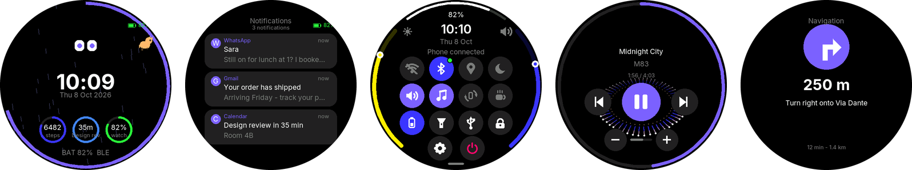

## Screenshots

| | | | |
|:-:|:-:|:-:|:-:|
| 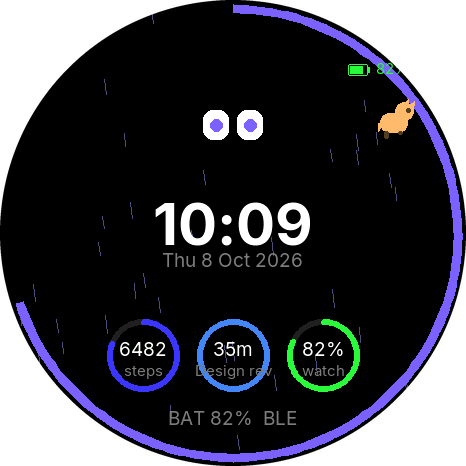 | 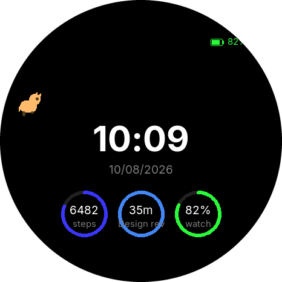 | 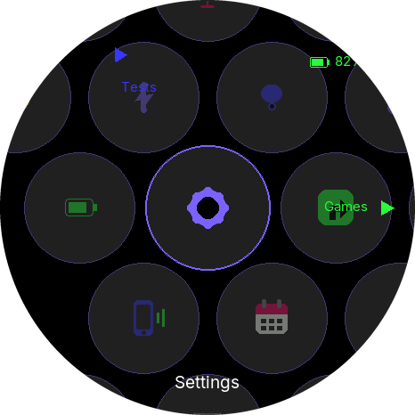 | 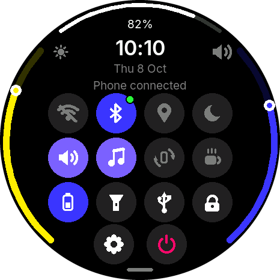 |
| Watch face + complications | Minimal face | App menu | Quick panel |
| 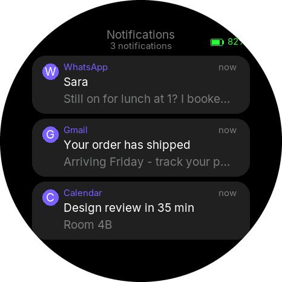 |  | 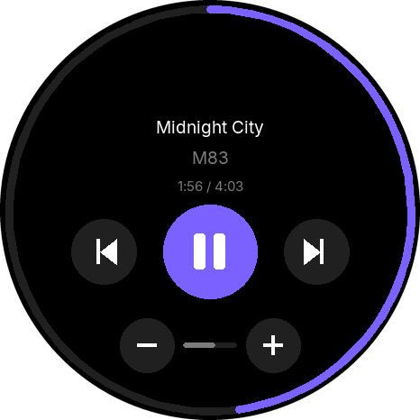 | 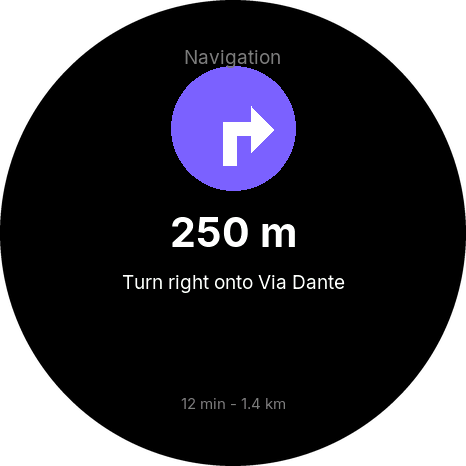 |
| Notifications | Incoming call | Phone's music | Turn-by-turn |
| 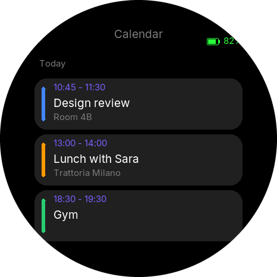 | 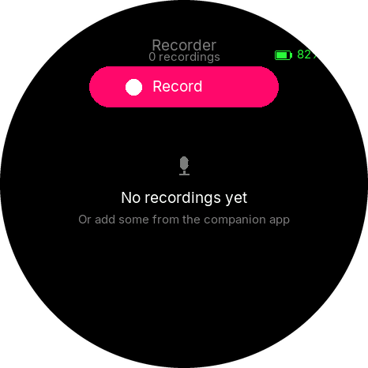 | 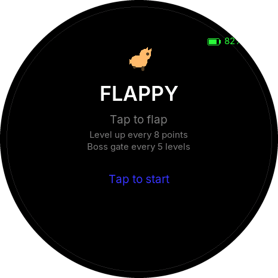 | 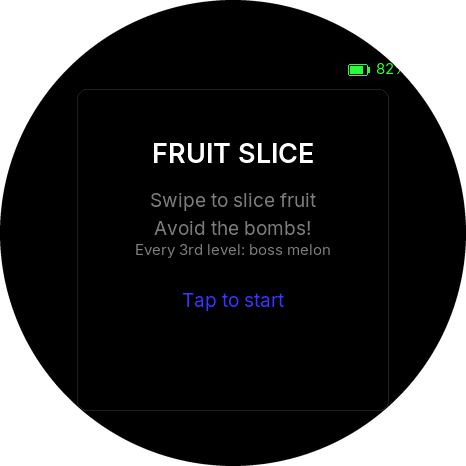 |
| Calendar | Voice recorder | Flappy | Fruit Slice |
| 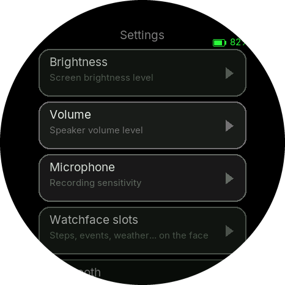 | 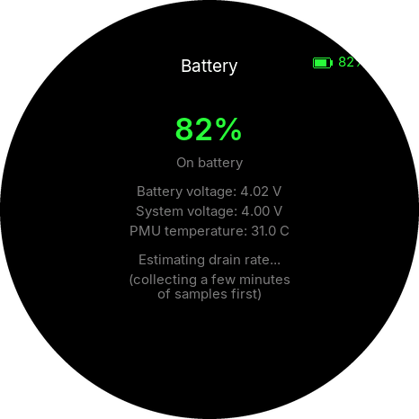 | 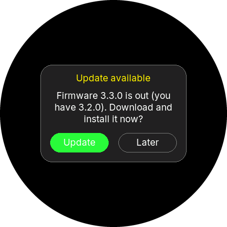 | 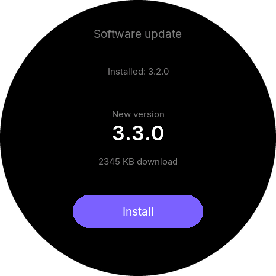 |
| Settings | Battery | Update found on Wi-Fi | Software update |
| 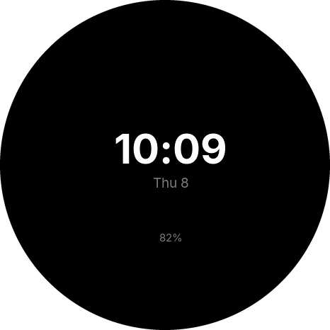 | | | |
| Always-on display | | | |

### In motion

| | | | | |
|:-:|:-:|:-:|:-:|:-:|
|  |  | 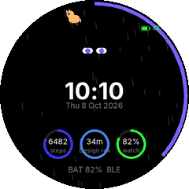 | 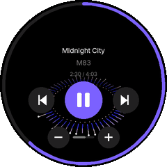 | 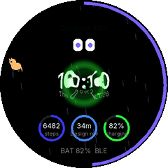 |
| Power on | Unlock | Lock | 3D spectrum ring | Charging |

Rendered from the real UI code by the [host simulator](tools/watch_sim) - what you see is what the watch draws.

## On the watch

- **Faces** - Default, Minimal and custom faces designed in the app; complication slots for steps, next event,
  weather, battery, phone battery, messages, next turn, memo to-dos and seconds. A little pet lives on the face.
- **Smooth UI** - slide transitions, edge-swipe back, kinetic lists, a pull-down quick panel (brightness,
  volume, radios, DND, torch, battery modes), smooth fonts with accents, auto-rotate.
- **3D effects** - software-rendered on the watch: a particle power-on sequence, lock/unlock that tilt the real
  screen into the distance and switch it off like a CRT, a 3D spectrum ring round the music controls, and a
  spinning 3D bolt when charging starts.
- **Phone link** - notifications with app icons and quick and voice replies, incoming calls (answer/decline), music remote with album art,
  Google Maps turn-by-turn, calendar with offline reminders, weather, Do Not Disturb synced both ways, find my phone.
- **Apps** - Recorder, Music and Media player (MP3/AAC, video), Gallery, Files, Contacts, Phone, Battery,
  3D printer status (Bambu), sensor tests.
- **Games** - Flappy, Fruit Slice, Breakout, Snake, Runner, Crystal Cavern, Maze Raider, Ninja Dungeon, Blackjack,
  Simon, Dodger, Plane, Reaction - played by touch, tilt, the phone as a gamepad, or an ESP-NOW joystick.
- **Health** - hardware pedometer with daily history, GPS (on the `-G` board).
- **Power** - light sleep with the phone still connected, an always-on display, battery modes
  (Balanced / Saver / Ultra), wake on wrist raise or tap, auto-dim.
- **System** - encrypted pairing, crash reports, signed firmware updates over Bluetooth or Wi-Fi with automatic
  rollback, USB modes, guided first-boot setup.

## In the companion app (Android)

- Pair, reconnect automatically and keep the link alive in the background; home-screen widget.
- Forward notifications (per app), calls, media, calendar, navigation and weather to the watch.
- **Voice memos** - sync recordings (Bluetooth or fast Wi-Fi), or record one on the spot with the phone's mic
  (it's copied to the watch too); transcribe with Whisper and summarize with Gemma / Qwen, all on the phone. Topics, to-dos, people, insights, search and "Ask AI" over your memos.
- Watch face designer and library, complication slots, quick replies, DND and bedtime.
- Activity history, contacts and files to the watch, the phone as a gamepad, watch Wi-Fi setup, diagnostics and crash reports.
- **Updates** - checks GitHub for a new app and watch firmware, and installs both.

## Getting started

1. **Flash the watch once over USB** - build and upload from the Arduino IDE (see [Building](#building)).
   From then on, updates arrive over the air.
2. **Install the app** - `AmoledWatch-x.y.z.apk` from the
   [latest release](https://github.com/MikeCheek/CustomOS-ESP32-S3-1.75/releases/latest).
3. **Pair** - open the app, connect, and type the 6-digit code the watch shows.

## Updates

One release (tag `vX.Y.Z`) carries both the firmware and the app.

- **Watch:** checks once a day on Wi-Fi and asks before installing; Settings › Software update checks now.
- **App:** checks when it opens and offers the new APK and the new watch firmware (installed over Bluetooth);
  Settings › Software updates checks now.
- Failed updates leave the current version in place; a firmware that doesn't survive its first minute rolls back.

Publishing and signing

- Bump `FW_VERSION` in `firmware/diag.h`, tag `vX.Y.Z` and push - CI builds and publishes the release.
- **Signed firmware:** `python scripts/ota_keygen.py` once, flash that build over USB, and put `keys/ota_private.pem`
  in the `OTA_PRIVATE_KEY` repository secret. CI then also publishes a `.signed.bin`, the only kind the watch accepts.
- **App signing:** Android only installs an update signed with the same key. Set `ANDROID_KEYSTORE_BASE64`,
  `ANDROID_KEYSTORE_PASSWORD`, `ANDROID_KEY_ALIAS` and `ANDROID_KEY_PASSWORD` so every release uses one keystore.
- The watch's update source is `FW_UPDATE_REPO` in `firmware/config.h`; the app's is `UpdateService.repo`.

## Building

| | |
|---|---|
| **Firmware** | **PlatformIO** (recommended, what releases use): `pio run -t upload` - same sources, plus ESP-IDF power management and Bluetooth modem sleep, so the watch light-sleeps with the phone connected. The first build compiles the core's libraries and takes a while. |
| **Arduino IDE** | Also builds, without the power management: core **esp32 3.3.10**, board *ESP32S3 Dev Module*, PSRAM *OPI*, flash 16 MB, partitions *16M Flash (3MB APP/9.9MB FATFS)*, USB CDC on boot. Libraries pinned in [`scripts/arduino-libraries.txt`](scripts/arduino-libraries.txt); three more are vendored in `firmware/libraries/`. |
| **CLI** | `arduino-cli compile -b esp32:esp32:esp32s3:PSRAM=opi,FlashSize=16M,PartitionScheme=app3M_fat9M_16MB,CDCOnBoot=cdc --libraries firmware/libraries firmware` |
| **App** | `cd companion_app && flutter pub get && flutter run` |
| **Screenshots** | `tools/watch_sim/run.sh` - compiles the UI for the PC and renders `docs/screenshots/` |
| **CI** | every push builds the firmware (PlatformIO, and the Arduino IDE build as a check) and the APK; a `v*` tag publishes a release |

**Layout:** `firmware/` the Arduino sketch · `companion_app/` the Flutter app · `scripts/` signing and setup helpers ·
`tools/watch_sim/` the screenshot simulator · [`COMPANION_PROTOCOL.md`](COMPANION_PROTOCOL.md) the watch ↔ app protocol ·
[`ROADMAP.md`](ROADMAP.md) what's done and next.

Hardware and under the hood

- **Board:** ESP32-S3 (16 MB flash, 8 MB PSRAM), CO5300 AMOLED over QSPI, CST9217 touch, QMI8658 IMU, PCF85063 RTC,
  AXP2101 PMU, ES8311 speaker + ES7210 mic array, TCA9554 IO expander, microSD, LC76G GPS (`-G` variant).
  Pins live in `firmware/board_pins.h`.
- **Rendering:** frames are drawn into PSRAM buffers on one core and sent by a task on the other, diffed against
  what the panel shows so only changed rectangles go over QSPI (idea borrowed from Meta's MUSE firmware).
- **Screens:** a `Screen` struct per app (`ui.h`) on a stack with slide transitions; HAL modules (`hal_*.cpp`)
  behind feature flags in `config.h`.
- **Link:** a paired, encrypted BLE connection carrying small JSON messages, plus Wi-Fi for big transfers.

